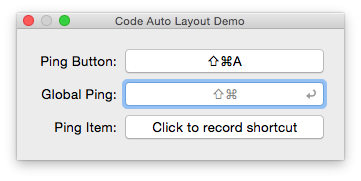

ShortcutRecorder 2
====================


The only user interface control to record shortcuts. For Mac OS X 10.7+, 64bit.

- :microscope: Support for Xcode 6 Quick Help
- :microscope: Support for Xcode 6 Interface Builder integration
- Fresh Look & Feel (brought to you by [Wireload](http://wireload.net) and [John Wells](https://github.com/jwells89))
- With Retina support
- Auto Layout ready
- Correct drawing on Layer-backed and Layer-hosted views
- Accessibility for people with disabilities
- Revised codebase with Automatic Reference Counting support
- Translated into 24 languages

Includes framework to set global shortcuts (PTHotKey).

Integrate into your project
---------------------------

There are two ways to integrate ShortcutRecorder into your project. You can either add ShortcutRecorder using a git submodule and add it as a framework or declare a CocoaPods dependency for your project.

### Integrating using a git submodule and adding it as a framework

1. Add ShortcutRecorder to your project using git submodules. Alternatively download the sources from the repository site.

    `git submodule add git://github.com/Kentzo/ShortcutRecorder.git`
2. Next, add `ShortcutRecorder.xcodeproj` to your workspace via Xcode ([Apple docs](https://developer.apple.com/library/mac/recipes/xcode_help-structure_navigator/articles/Adding_an_Existing_Project_to_a_Workspace.html)). Don't have a workspace? No problem, just add ShortcutRecorder.xcodeproj via the "Add Files to" dialog.
3. Ensure that your target is linked against the ShortcutRecorder or/and PTHotKey frameworks ([Apple docs](http://developer.apple.com/library/ios/#recipes/xcode_help-project_editor/Articles/AddingaLibrarytoaTarget.html#//apple_ref/doc/uid/TP40010155-CH17)). Desired frameworks will be listed under *Workspace*.
4. Now it's time to make the frameworks part of your app. To do this, you need to add a custom Build Phase ([Apple docs](http://developer.apple.com/library/ios/#recipes/xcode_help-project_editor/Articles/CreatingaCopyFilesBuildPhase.html)). Remember to set *Destination* to *Frameworks* and clean up *Subpath*.
5. Finally, we need to ensure that your app will find the frameworks upon start. Open the Build Settings of your target, look up *Runtime Search Paths*. Add `@executable_path/../Frameworks` to the list of paths.

### Integrating using a CocoaPods dependency

1. [Install CocoaPods](https://guides.cocoapods.org/using/getting-started.html) if you haven't installed this dependency manager yet.
2. Create a file named `Podfile` in your project's root directory (or run `pod init`) and add a dependency to ShortcutRecorder using the following file content. If you want to use a specific release version instead of latest release, replace the `:branch` attribute with `:tag => '2.17'`.

    ```
    platform :osx, '10.9'
    use_frameworks!
    pod 'ShortcutRecorder/Core', :git => 'https://github.com/Kentzo/ShortcutRecorder', :branch => 'master'
    ```
3. Run `pod install` from your project's root directory.
4. From now on open the newly created Xcode workspace to modify and run your application.


Adding the control in Interface Builder
---------------------------------------
In Xcode 4 Apple removed Interface Builder plugins. You can only use IB to add and position/resize ShortcutRecorder control. To do this, add q Custom View and set its class to `SRRecorderControl`.

SRRecorderControl has a fixed height of 25 points so please ensure you do not use autoresizing masks/layout rules which allows vertical resizing. I recommend that you pin the height in case you're using Auto Layout.

Usage
-----
First, we want to keep the value of the control across relaunches of the app. We can simply achieve this by using `NSUserDefaultsController` and bindings:

    [self.pingShortcutRecorder bind:NSValueBinding
                           toObject:[NSUserDefaultsController sharedUserDefaultsController]
                        withKeyPath:@"values.ping"
                            options:nil];

The value can be used to set the key equivalent of an NSMenuItem or NSButton. It can also be used to register a global shortcut.

Setting the key equivalent of an `NSMenuItem` using bindings:

    [self.pingItem bind:@"keyEquivalent"
               toObject:defaults
            withKeyPath:@"values.ping"
                options:@{NSValueTransformerBindingOption: [SRKeyEquivalentTransformer new]}];
    [self.pingItem bind:@"keyEquivalentModifierMask"
               toObject:defaults
            withKeyPath:@"values.ping"
                options:@{NSValueTransformerBindingOption: [SRKeyEquivalentModifierMaskTransformer new]}];

Setting the key equivalent of an `NSButton` using bindings:

    [self.pingButton bind:@"keyEquivalent"
                 toObject:defaults
              withKeyPath:@"values.ping"
                  options:@{NSValueTransformerBindingOption: [SRKeyEquivalentTransformer new]}];
    [self.pingButton bind:@"keyEquivalentModifierMask"
                 toObject:defaults
              withKeyPath:@"values.ping"
                  options:@{NSValueTransformerBindingOption: [SRKeyEquivalentModifierMaskTransformer new]}];

Setting global shortcut using `PTHotKeyCenter`:

    PTHotKeyCenter *hotKeyCenter = [PTHotKeyCenter sharedCenter];
    PTHotKey *oldHotKey = [hotKeyCenter hotKeyWithIdentifier:aKeyPath];
    [hotKeyCenter unregisterHotKey:oldHotKey];

    PTHotKey *newHotKey = [PTHotKey hotKeyWithIdentifier:aKeyPath
                                                keyCombo:newShortcut
                                                  target:self
                                                  action:@selector(ping:)];
    [hotKeyCenter registerHotKey:newHotKey];

Key Equivalents and Keyboard Layout
-----------------------------------
While ShortcutRecorder keeps your shortcuts as a combination of *key code* and modifier masks, key equivalents are expressed using *key character* and modifier mask. The difference is that the position of a key code on a keyboard does not depend on the current keyboard layout while the position of a key character does.

ShortcutRecorder includes two special transformers to simplify binding to the key equivalents of NSMenuItem and NSButton:

- `SRKeyEquivalentTransformer`
- `SRKeyEquivalentModifierMaskTransformer`

SRKeyEquivalentTransformer uses ASCII keyboard layout to convert the key code into a character. This way the resulting character does not depend on the keyboard layout.
The drawback is that the position of the character on the keyboard may change depending on the layout and modifier keys used (primarily Option and Shift).

NSButton
--------
If you're going to bind ShortcutRecorder to the key equivalent of an NSButton, I encourage you to require `NSCommandKeyMask`.
This is because NSButton handles key equivalents in a very strange way. Rather than investigating all information available for the keyboard event, it just checks `charactersIgnoringModifiers`
and compares the returned value with its `keyEquivalent`. Unfortunately, Cocoa returns keyboard-layout-independent (ASCII) representation of characters only when NSCommandKeyMask is set.
If it's not set, the assigned shortcut likely won't work with other layouts.

Coding Style
------------
Please use (four) spaces for indentation. It's not that all contributors prefer spaces over tabs or vice versa. Most of the code in the project used spaces at one point and it was easier to convert the occasional tab than all the spaces.

Questions
---------
Still have questions? [Create an issue](https://github.com/Kentzo/ShortcutRecorder/issues/new) immediately and feel free to ping me.

Paid Support
------------
If functionality you need is missing, but you're ready to pay for it, feel free to contact me. If not, create an issue anyway, I'll take a look as soon as I can.
